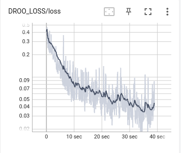

# DROO_JULIA

use the julia to implement the DROO algorithm.

## environments

run
- julia
    - Flux
    - TensorboardLogger

board
- python
    - tensorboard

与python在执行时间上的差异
julia: 34 s
python: 7 m

